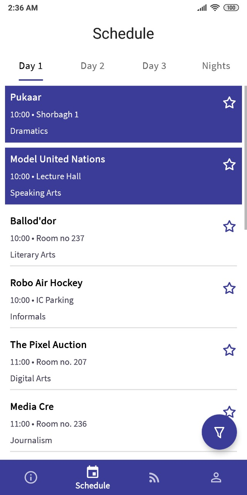
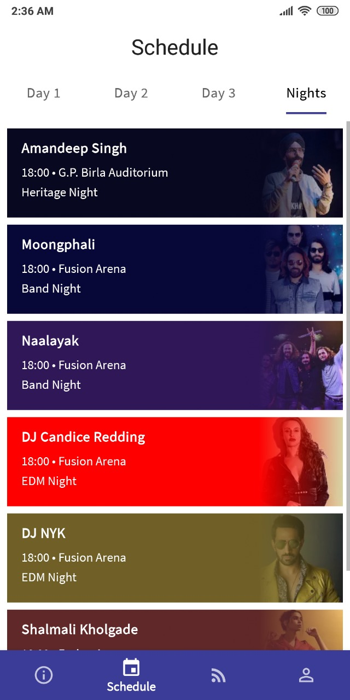
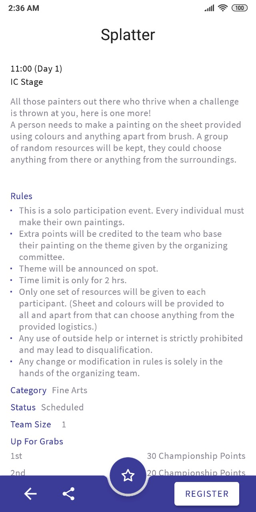
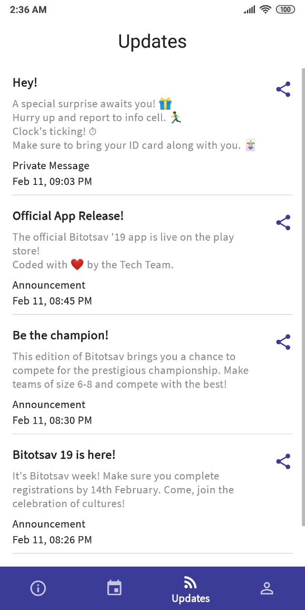
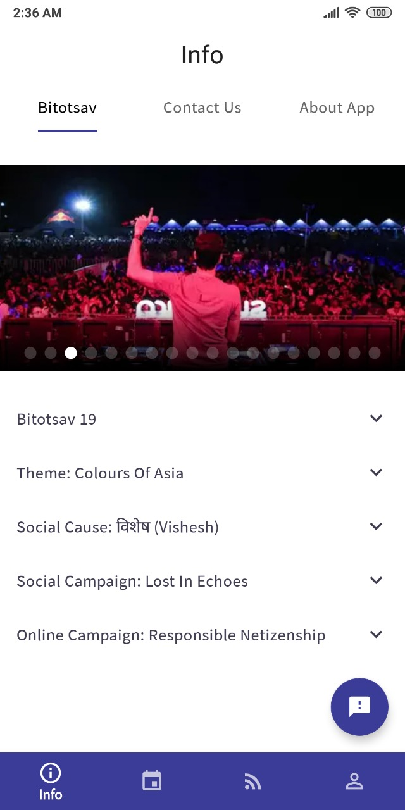
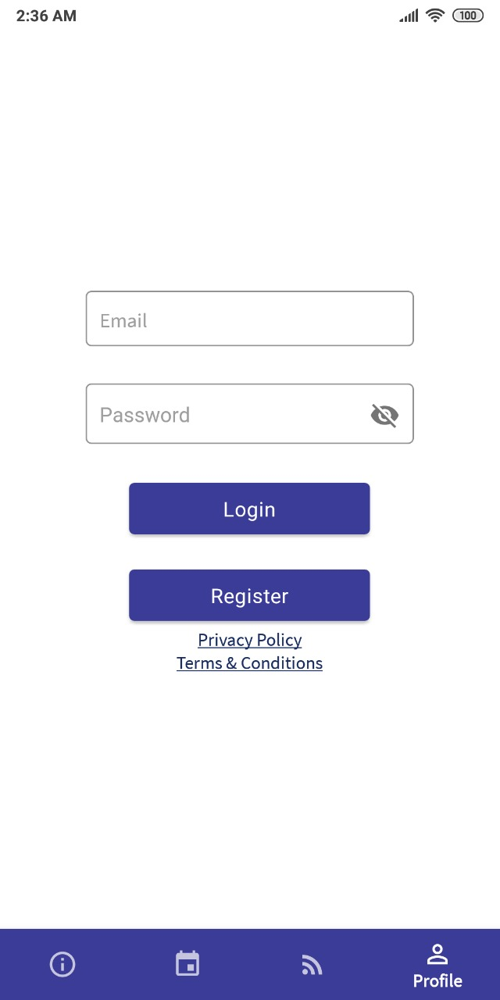
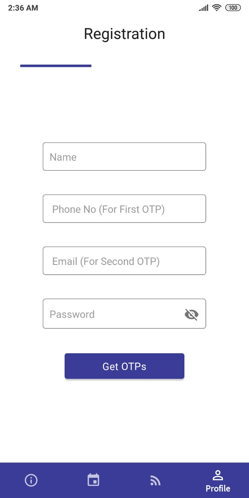
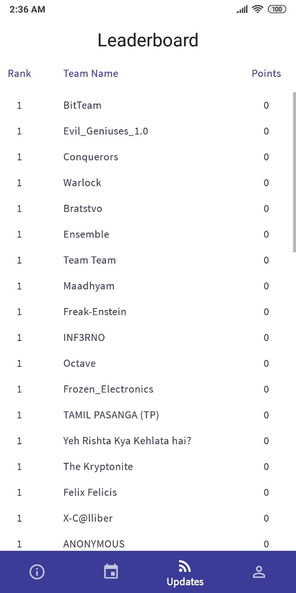

# Bitotsav '19


The official app for the 29th edition of Bitotsav, BIT Mesra's annual socio-cultural fest.

Note: The functionality of the app is limited after the fest, as the servers are offline, but most of the data related to events and rankings has been preserved as json for archival purposes, and full functionality exists in the code.

<p align="center">
<a href="https://play.google.com/store/apps/details?id=in.bitotsav">
    
</a>
</p>

## About

Bitotsav '19, the 29th edition of Birla Institute of Technology, Mesra's annual socio-cultural fest, took place from the 14th to the 17th of February, 2019, featuring 4 nights and 48 events. This app was created by the tech team for proper management of the fest, assisting both participants and organizers by acting as a medium for latest updates as well as the source of knowledge for event details like rules, timings & venues, payment status, rankings & results and much more, all dynamic and real time. Additionally, to complement the theme i.e. "Colours of Asia", the UI colors change on every start.

## Features

- **Profile:** Login with Bitotsav Id to access Team Statistics, Activity and Night Pass status.
- **Individual Registration:** Register and get your Bitotsav Id.
- **Championship Registration:** Register a team of 6-8 for Bitotsav Championship.
- **Schedule:** Full events listed sorted by time, separated by day and a dedicated section for nights.
- **Event Filters:** Filter the event list based on categories and starred status.
- **Event Details:** Select any event to get detailed information, contact coordinators, see results etc.
- **Event Registration:** Register a team for any event.
- **Subscription:** Subscribe to events you like to receive personalised alerts and updates.
- **Feed:** Real time updates from the Bitotsav '19 team.
- **Leaderboard:** Live standings of all registered championship teams.

## Screenshots

<p float="left">










## Permissions

No explicit permissions are used by this app, but it does prompt users of devices of certain manufacturers to enable autostart and disable battery optimization to ensure timely delivery of notifications.

## Tech

### Overview

- Developed in **Kotlin** with **Android Studio Canary** as IDE and latest technologies such as AndroidX, Jetpack Architecture Components, Coroutines etc.
- MVVM architecture
- Feature based package structure

### Android SDK Components

- AndroidX
- Navigation
- Room
- WorkManager
- Data Binding
- Live Data
- ViewModel
- Palette

### Network Libraries

- [Retrofit 2](https://github.com/square/retrofit) by Square
- [Gson](https://github.com/google/gson) by Google
- Firebase (FCM)
- Safety Net (reCAPTCHA v2)

### Other Third Party Libraries

- [Koin 2 (Beta)](https://github.com/InsertKoinIO/koin) by [InsertKoin.io](insert-koin.io)
- [Retrofit Kotlin Coroutine Adapter](https://github.com/JakeWharton/retrofit2-kotlin-coroutines-adapter) by Jake Wharton
- [AppKillerManager](https://github.com/thelittlefireman/AppKillerManager/tree/master) by thelittlefireman
- [Smart App Rate](https://github.com/codemybrainsout/smart-app-rate) by Code My Brains Out
- [Glide](https://github.com/bumptech/glide) by Sam Judd
- [Android image slider](https://github.com/smarteist/android-image-slider) by Smarteist

### Other Tech

- Git Workflow - [Gitflow](https://www.atlassian.com/git/tutorials/comparing-workflows/gitflow-workflow) (using [gitflow-avh](https://github.com/petervanderdoes/gitflow-avh))
- Versioning - [Semantic Versioning 2.0.0](https://semver.org/)

## TODO

- [ ] Tests
- [ ] Better documentation

## License

```
Copyright 2019 Aakarshit Uppal, Ashank Anshuman

Licensed under the Apache License, Version 2.0 (the "License");
you may not use this file except in compliance with the License.
You may obtain a copy of the License at

    http://www.apache.org/licenses/LICENSE-2.0

Unless required by applicable law or agreed to in writing, software
distributed under the License is distributed on an "AS IS" BASIS,
WITHOUT WARRANTIES OR CONDITIONS OF ANY KIND, either express or implied.
See the License for the specific language governing permissions and
limitations under the License.
```